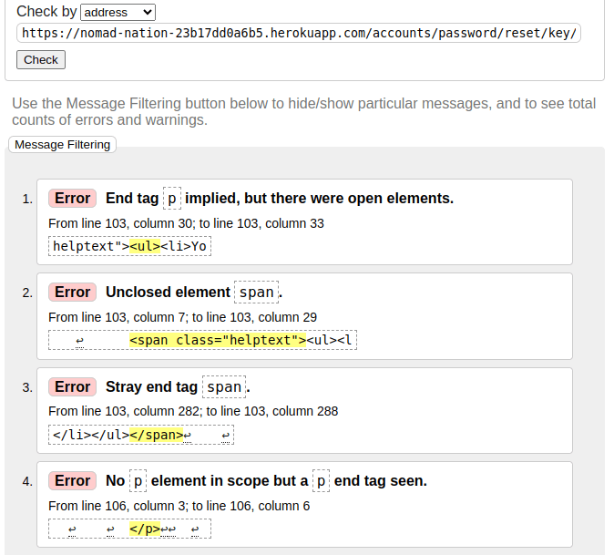
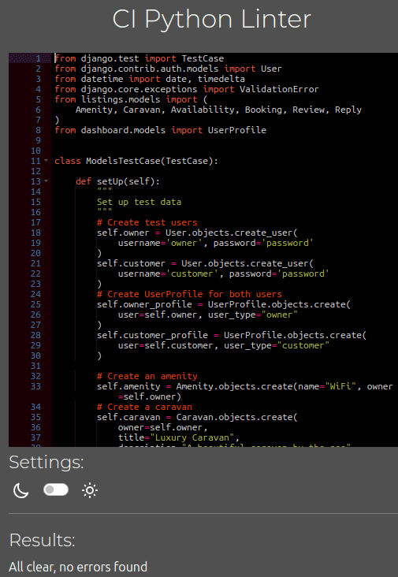
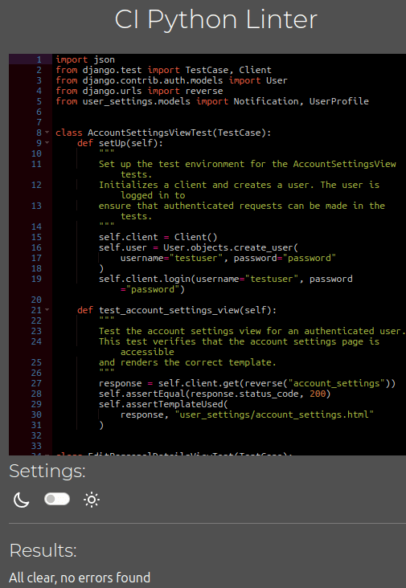
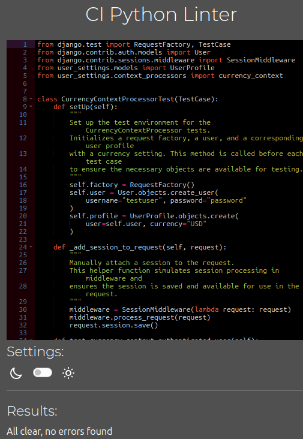
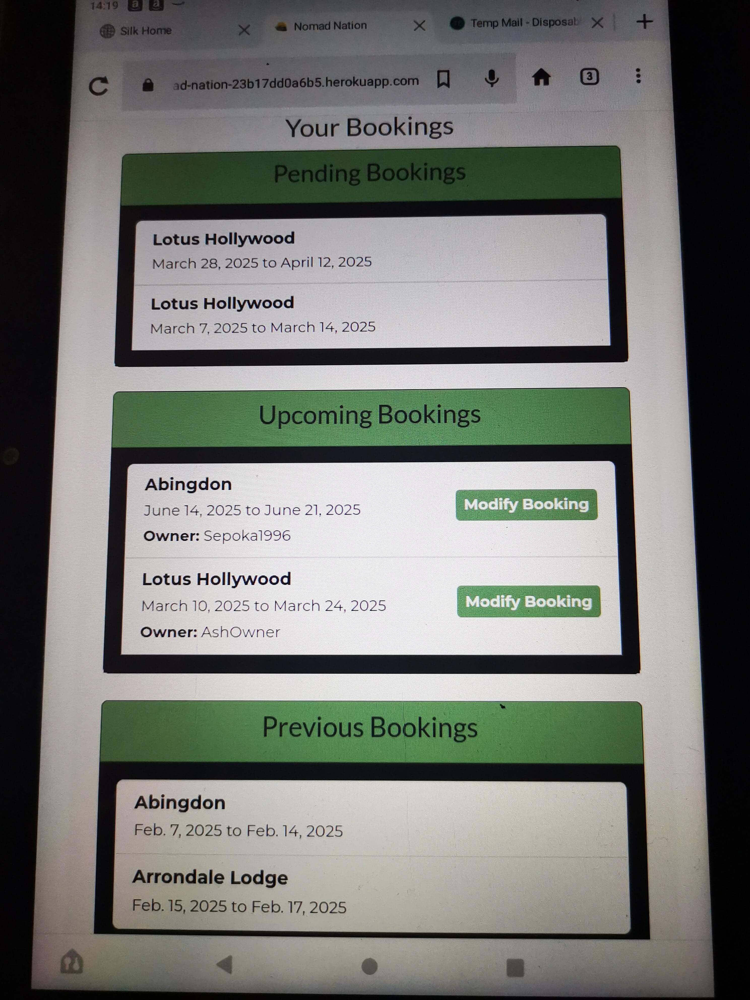
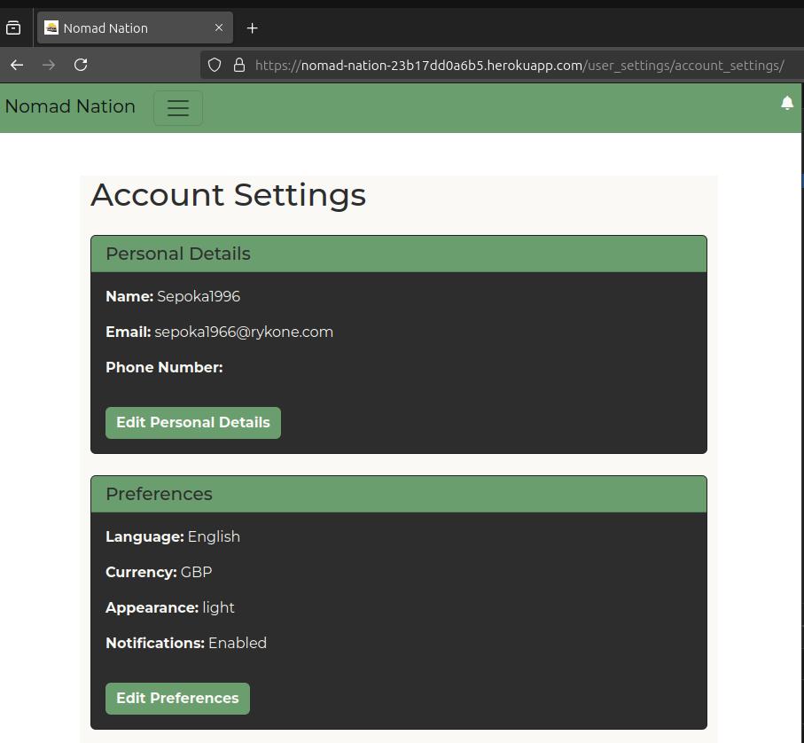
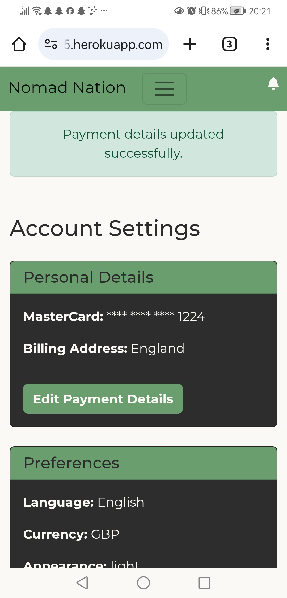
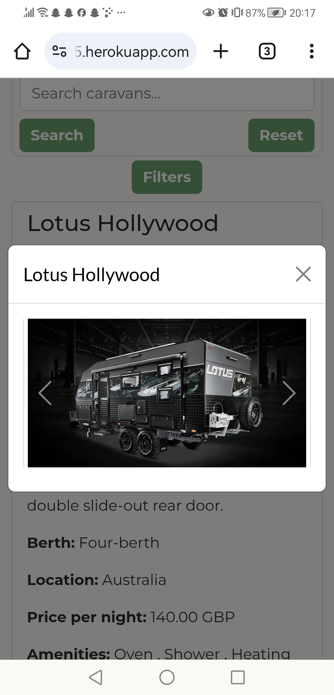
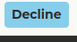
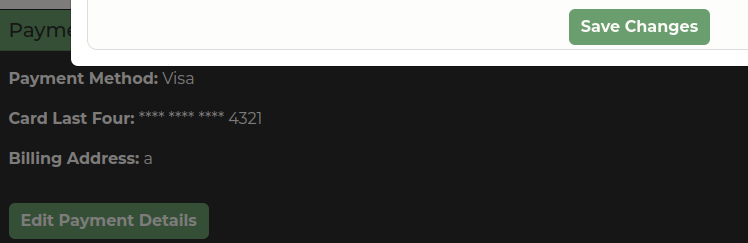

# Testing

> [!NOTE]
> Return back to the [README.md](README.md) file.

## Code Validation

### HTML

I have used the recommended [HTML W3C Validator](https://validator.w3.org) to validate all of my HTML files.

| Directory         | File                                                                                                                                        | URL                                                                                                                                                                                     | Screenshot                                                               | Notes                                         |
| ----------------- | ------------------------------------------------------------------------------------------------------------------------------------------- | --------------------------------------------------------------------------------------------------------------------------------------------------------------------------------------- | ------------------------------------------------------------------------ | --------------------------------------------- |
| templates         | [base.html](https://github.com/AshLaw96/Nomad-Nation/blob/main/templates/base.html)                                                         | [HTML W3C Validator Link](https://validator.w3.org/nu/#textarea)                                                                                                                        |                     | Direct input, failed because of Django code   |
| templates         | [404.html](https://github.com/AshLaw96/Nomad-Nation/blob/main/templates/404.html)                                                           | [HTML W3C Validator Link](https://validator.w3.org/nu/#textarea)                                                                                                                        |                      | Source code input, no errors                  |
| templates         | [500.html](https://github.com/AshLaw96/Nomad-Nation/blob/main/templates/500.html)                                                           | [HTML W3C Validator Link](https://validator.w3.org/nu/#textarea)                                                                                                                        |                      | Source code input, no errors                  |
| templates/account | [login.html](https://github.com/AshLaw96/Nomad-Nation/blob/main/templates/account/login.html)                                               | [HTML W3C Validator Link](https://pep8ci.herokuapp.com/https://raw.githubusercontent.com/AshLaw96/Nomad-Nation/main/main/admin.py)                                                      |                    | All clear, no errors                          |
| templates/account | [logout.html](https://github.com/AshLaw96/Nomad-Nation/blob/main/templates/account/logout.html)                                             | [HTML W3C Validator Link](https://validator.w3.org/nu/?doc=https%3A%2F%2Fnomad-nation-23b17dd0a6b5.herokuapp.com%2Faccounts%2Flogin%2F)                                                 |                   | All clear, no errors                          |
| templates/account | [password_reset_done.html](https://github.com/AshLaw96/Nomad-Nation/blob/main/templates/account/password_reset_done.html)                   | [HTML W3C Validator Link](https://validator.w3.org/nu/?doc=https%3A%2F%2Fnomad-nation-23b17dd0a6b5.herokuapp.com%2Faccounts%2Fpassword%2Freset%2Fkey%2F4-set-password%2F)               |      | All clear, no errors                          |
| templates/account | [password_reset_from_key_done.html](https://github.com/AshLaw96/Nomad-Nation/blob/main/templates/account/password_reset_from_key_done.html) | [HTML W3C Validator Link](https://validator.w3.org/nu/?doc=https%3A%2F%2Fnomad-nation-23b17dd0a6b5.herokuapp.com%2Faccounts%2Fpassword%2Freset%2Fkey%2Fdone%2F)                         |  | All clear, no errors                          |
| templates/account | [password_reset_from_key.html](https://github.com/AshLaw96/Nomad-Nation/blob/main/templates/account/password_reset_from_key.html)           | [HTML W3C Validator Link](https://pep8ci.herokuapp.com/https://raw.githubusercontent.com/AshLaw96/Nomad-Nation/main/main/views.py)                                                      |       | Errors showing but from externally added code |
| templates/account | [password_reset.html](https://github.com/AshLaw96/Nomad-Nation/blob/main/templates/account/password_reset.html)                             | [HTML W3C Validator Link](https://validator.w3.org/nu/?doc=https%3A%2F%2Fnomad-nation-23b17dd0a6b5.herokuapp.com%2Faccounts%2Fpassword%2Freset%2F)                                      |           | All clear, no errors                          |
| templates/account | [signup.html](https://github.com/AshLaw96/Nomad-Nation/blob/main/templates/account/signup.html)                                             | [HTML W3C Validator Link](https://validator.w3.org/nu/?doc=https%3A%2F%2Fnomad-nation-23b17dd0a6b5.herokuapp.com%2Faccounts%2Fsignup%2F)                                                |                   | Errors showing but from externally added code |
| dashboard         | [dashboard.html](https://github.com/AshLaw96/Nomad-Nation/blob/main/dashboard/templates/dashboard/dashboard.html)                           | [HTML W3C Validator Link](https://validator.w3.org/nu/?doc=https%3A%2F%2Fnomad-nation-23b17dd0a6b5.herokuapp.com%2Faccounts%2Flogin%2F%3Fnext%3D%2Fdashboard%2F)                        |                     | All clear, no errors                          |
| listings          | [add_caravan.html](https://github.com/AshLaw96/Nomad-Nation/blob/main/listings/templates/listings/add_caravan.html)                         | [HTML W3C Validator Link](https://validator.w3.org/nu/?doc=https%3A%2F%2Fnomad-nation-23b17dd0a6b5.herokuapp.com%2Faccounts%2Flogin%2F%3Fnext%3D%2Flistings%2Fadd%2F)                   |              | All clear, no errors                          |
| listings          | [booking.html](https://github.com/AshLaw96/Nomad-Nation/blob/main/listings/templates/listings/booking.html)                                 | [HTML W3C Validator Link](https://validator.w3.org/nu/?doc=https%3A%2F%2Fnomad-nation-23b17dd0a6b5.herokuapp.com%2Faccounts%2Flogin%2F%3Fnext%3D%2Flistings%2Fbookings%2F)              |                     | All clear, no errors                          |
| listings          | [listing_page.html](https://github.com/AshLaw96/Nomad-Nation/blob/main/listings/templates/listings/listing_page.html)                       | [HTML W3C Validator Link](https://validator.w3.org/nu/?doc=https%3A%2F%2Fnomad-nation-23b17dd0a6b5.herokuapp.com%2Faccounts%2Flogin%2F%3Fnext%3D%2Flistings%2Flistings%2F)              |                     | All clear, no errors                          |
| main              | [contact.html](https://github.com/AshLaw96/Nomad-Nation/blob/main/main/templates/main/contact.html)                                         | [HTML W3C Validator Link](https://validator.w3.org/nu/?doc=https%3A%2F%2Fnomad-nation-23b17dd0a6b5.herokuapp.com%2Fcontact%2F)                                                          |                  | All clear, no errors                          |
| main              | [home.html](https://github.com/AshLaw96/Nomad-Nation/blob/main/main/templates/main/home.html)                                               | [HTML W3C Validator Link](https://validator.w3.org/nu/?doc=https%3A%2F%2Fnomad-nation-23b17dd0a6b5.herokuapp.com%2F)                                                                    |                     | All clear, no errors                          |
| user_settings     | [account_settings.html](https://github.com/AshLaw96/Nomad-Nation/blob/main/user_settings/templates/user_settings/account_settings.html)     | [HTML W3C Validator Link](https://validator.w3.org/nu/?doc=https%3A%2F%2Fnomad-nation-23b17dd0a6b5.herokuapp.com%2Faccounts%2Flogin%2F%3Fnext%3D%2Fuser_settings%2Faccount_settings%2F) |                  | All clear no errors                           |

### CSS

I have used the recommended [CSS Jigsaw Validator](https://jigsaw.w3.org/css-validator) to validate all of my CSS files.

| Directory  | File                                                                                   | URL                                                                                                                          | Screenshot                                          | Notes                                           |
| ---------- | -------------------------------------------------------------------------------------- | ---------------------------------------------------------------------------------------------------------------------------- | --------------------------------------------------- | ----------------------------------------------- |
| static/css | [styles.css](https://github.com/AshLaw96/Nomad-Nation/blob/main/static/css/styles.css) | [HTML W3C Validator Link](https://jigsaw.w3.org/css-validator/validator?uri=https://nomad-nation-23b17dd0a6b5.herokuapp.com) |  | Errors showing but from externally added styles |

### JavaScript

I have used the recommended [JShint Validator](https://jshint.com) to validate all of my JS files.

| Directory | File                                                                                | URL                           | Screenshot                                             | Notes                |
| --------- | ----------------------------------------------------------------------------------- | ----------------------------- | ------------------------------------------------------ | -------------------- |
| static/js | [script.js](https://github.com/AshLaw96/Nomad-Nation/blob/main/static/js/script.js) | [JSHint](https://jshint.com/) |  | All clear, no errors |

### Python

I have used the recommended [PEP8 CI Python Linter](https://pep8ci.herokuapp.com) to validate all of my Python files.

| Directory       | File                                                                                                            | URL                                                                                                                                              | Screenshot                                                          | Notes                |
| --------------- | --------------------------------------------------------------------------------------------------------------- | ------------------------------------------------------------------------------------------------------------------------------------------------ | ------------------------------------------------------------------- | -------------------- |
| caravan_booking | [settings.py](https://github.com/AshLaw96/Nomad-Nation/blob/main/caravan_booking/py/settings.py)                | [PEP8 CI Link](https://pep8ci.herokuapp.com/https://raw.githubusercontent.com/AshLaw96/Nomad-Nation/main/caravan_booking/settings.py)            |              | All clear, no errors |
| caravan_booking | [urls.py](https://github.com/AshLaw96/Nomad-Nation/blob/main/caravan_booking/urls.py)                           | [PEP8 CI Link](https://pep8ci.herokuapp.com/https://raw.githubusercontent.com/AshLaw96/Nomad-Nation/main/caravan_booking/urls.py)                |     | All clear, no errors |
| caravan_booking | [views.py](https://github.com/AshLaw96/Nomad-Nation/blob/main/caravan_booking/views.py)                         | [PEP8 CI Link](https://pep8ci.herokuapp.com/https://raw.githubusercontent.com/AshLaw96/Nomad-Nation/main/caravan_booking/views.py)               |     | All clear, no errors |
| main            | [admin.py](https://github.com/AshLaw96/Nomad-Nation/blob/main/main/admin.py)                                    | [PEP8 CI Link](https://pep8ci.herokuapp.com/https://raw.githubusercontent.com/AshLaw96/Nomad-Nation/main/main/admin.py)                          |            | All clear, no errors |
| main            | [models.py](https://github.com/AshLaw96/Nomad-Nation/blob/main/main/models.py)                                  | [PEP8 CI Link](https://pep8ci.herokuapp.com/https://raw.githubusercontent.com/AshLaw96/Nomad-Nation/main/main/models.py)                         |           | All clear, no errors |
| main            | [test_forms.py](https://github.com/AshLaw96/Nomad-Nation/blob/main/main/tests/test_forms.py)                    | [PEP8 CI Link](https://pep8ci.herokuapp.com/https://raw.githubusercontent.com/AshLaw96/Nomad-Nation/main/main/tests/test_forms.py)               |        | All clear, no errors |
| main            | [test_models.py](https://github.com/AshLaw96/Nomad-Nation/blob/main/main/tests/test_models.py)                  | [PEP8 CI Link](https://pep8ci.herokuapp.com/https://raw.githubusercontent.com/AshLaw96/Nomad-Nation/main/main/tests/test_models.py)              |      | All clear, no errors |
| main            | [test_views.py](https://github.com/AshLaw96/Nomad-Nation/blob/main/main/tests/test_views.py)                    | [PEP8 CI Link](https://pep8ci.herokuapp.com/https://raw.githubusercontent.com/AshLaw96/Nomad-Nation/main/main/tests/test_views.py)               |        | All clear, no errors |
| main            | [urls.py](https://github.com/AshLaw96/Nomad-Nation/blob/main/main/urls.py)                                      | [PEP8 CI Link](https://pep8ci.herokuapp.com/https://raw.githubusercontent.com/AshLaw96/Nomad-Nation/main/main/urls.py)                           |             | All clear, no errors |
| main            | [views.py](https://github.com/AshLaw96/Nomad-Nation/blob/main/main/views.py)                                    | [PEP8 CI Link](https://pep8ci.herokuapp.com/https://raw.githubusercontent.com/AshLaw96/Nomad-Nation/main/main/views.py)                          |             | All clear, no errors |
| main            | [forms.py](https://github.com/AshLaw96/Nomad-Nation/blob/main/main/forms.py)                                    | [PEP8 CI Link](https://pep8ci.herokuapp.com/https://raw.githubusercontent.com/AshLaw96/Nomad-Nation/main/main/forms.py)                          |             | All clear, no errors |
| dashboard       | [admin.py](https://github.com/AshLaw96/Nomad-Nation/blob/main/dashboard/admin.py)                               | [PEP8 CI Link](https://pep8ci.herokuapp.com/https://raw.githubusercontent.com/AshLaw96/Nomad-Nation/main/dashboard/admin.py)                     |            | All clear, no errors |
| dashboard       | [models.py](https://github.com/AshLaw96/Nomad-Nation/blob/main/dashboard/models.py)                             | [PEP8 CI Link](https://pep8ci.herokuapp.com/https://raw.githubusercontent.com/AshLaw96/Nomad-Nation/main/dashboard/models.py)                    |            | All clear, no errors |
| dashboard       | [test_forms.py](https://github.com/AshLaw96/Nomad-Nation/blob/main/dashboard/tests/test_forms.py)               | [PEP8 CI Link](https://pep8ci.herokuapp.com/https://raw.githubusercontent.com/AshLaw96/Nomad-Nation/main/dashboard/tests/test_forms.py)          |        | All clear, no errors |
| dashboard       | [test_models.py](https://github.com/AshLaw96/Nomad-Nation/blob/main/dashboard/tests/test_models.py)             | [PEP8 CI Link](https://pep8ci.herokuapp.com/https://raw.githubusercontent.com/AshLaw96/Nomad-Nation/main/dashboard/tests/test_models.py)         |       | All clear, no errors |
| dashboard       | [test_views.py](https://github.com/AshLaw96/Nomad-Nation/blob/main/dashboard/tests/test_views.py)               | [PEP8 CI Link](https://pep8ci.herokuapp.com/https://raw.githubusercontent.com/AshLaw96/Nomad-Nation/main/dashboard/tests/test_views.py)          |        | All clear, no errors |
| dashboard       | [urls.py](https://github.com/AshLaw96/Nomad-Nation/blob/main/dashboard/urls.py)                                 | [PEP8 CI Link](https://pep8ci.herokuapp.com/https://raw.githubusercontent.com/AshLaw96/Nomad-Nation/main/dashboard/urls.py)                      |             | All clear, no errors |
| dashboard       | [views.py](https://github.com/AshLaw96/Nomad-Nation/blob/main/dashboard/views.py)                               | [PEP8 CI Link](https://pep8ci.herokuapp.com/https://raw.githubusercontent.com/AshLaw96/Nomad-Nation/main/dashboard/views.py)                     |             | All clear, no errors |
| dashboard       | [forms.py](https://github.com/AshLaw96/Nomad-Nation/blob/main/dashboard/forms.py)                               | [PEP8 CI Link](https://pep8ci.herokuapp.com/https://raw.githubusercontent.com/AshLaw96/Nomad-Nation/main/dashboard/forms.py)                     |             | All clear, no errors |
| listings        | [admin.py](https://github.com/AshLaw96/Nomad-Nation/blob/main/listings/admin.py)                                | [PEP8 CI Link](https://pep8ci.herokuapp.com/https://raw.githubusercontent.com/AshLaw96/Nomad-Nation/main/listings/admin.py)                      |            | All clear, no errors |
| listings        | [models.py](https://github.com/AshLaw96/Nomad-Nation/blob/main/listings/models.py)                              | [PEP8 CI Link](https://pep8ci.herokuapp.com/https://raw.githubusercontent.com/AshLaw96/Nomad-Nation/main/listings/models.py)                     |           | All clear, no errors |
| listings        | [test_forms.py](https://github.com/AshLaw96/Nomad-Nation/blob/main/listings/tests/test_forms.py)                | [PEP8 CI Link](https://pep8ci.herokuapp.com/https://raw.githubusercontent.com/AshLaw96/Nomad-Nation/main/listings/tests/test_forms.py)           |        | All clear, no errors |
| listings        | [test_models.py](https://github.com/AshLaw96/Nomad-Nation/blob/main/listings/tests/test_models.py)              | [PEP8 CI Link](https://pep8ci.herokuapp.com/https://raw.githubusercontent.com/AshLaw96/Nomad-Nation/main/listings/tests/test_models.py)          |      | All clear, no errors |
| listings        | [test_views.py](https://github.com/AshLaw96/Nomad-Nation/blob/main/listings/tests/test_views.py)                | [PEP8 CI Link](https://pep8ci.herokuapp.com/https://raw.githubusercontent.com/AshLaw96/Nomad-Nation/main/listings/tests/test_views.py)           |       | All clear, no errors |
| listings        | [urls.py](https://github.com/AshLaw96/Nomad-Nation/blob/main/listings/urls.py)                                  | [PEP8 CI Link](https://pep8ci.herokuapp.com/https://raw.githubusercontent.com/AshLaw96/Nomad-Nation/main/listings/urls.py)                       |             | All clear, no errors |
| listings        | [views.py](https://github.com/AshLaw96/Nomad-Nation/blob/main/listings/views.py)                                | [PEP8 CI Link](https://pep8ci.herokuapp.com/https://raw.githubusercontent.com/AshLaw96/Nomad-Nation/main/listings/views.py)                      |             | All clear, no errors |
| listings        | [forms.py](https://github.com/AshLaw96/Nomad-Nation/blob/main/listings/forms.py)                                | [PEP8 CI Link](https://pep8ci.herokuapp.com/https://raw.githubusercontent.com/AshLaw96/Nomad-Nation/main/listings/forms.py)                      |             | All clear, no errors |
| user_settings   | [admin.py](https://github.com/AshLaw96/Nomad-Nation/blob/main/user_settings/admin.py)                           | [PEP8 CI Link](https://pep8ci.herokuapp.com/https://raw.githubusercontent.com/AshLaw96/Nomad-Nation/main/user_settings/admin.py)                 |            | All clear, no errors |
| user_settings   | [models.py](https://github.com/AshLaw96/Nomad-Nation/blob/main/user_settings/models.py)                         | [PEP8 CI Link](https://pep8ci.herokuapp.com/https://raw.githubusercontent.com/AshLaw96/Nomad-Nation/main/user_settings/models.py)                |           | All clear, no errors |
| user_settings   | [test_currency.py](https://github.com/AshLaw96/Nomad-Nation/blob/main/user_settings/tests/test_currency.py)     | [PEP8 CI Link](https://pep8ci.herokuapp.com/https://raw.githubusercontent.com/AshLaw96/Nomad-Nation/main/user_settings/tests/test_currency.py)   |    | All clear, no errors |
| user_settings   | [test_models.py](https://github.com/AshLaw96/Nomad-Nation/blob/main/user_settings/tests/test_models.py)         | [PEP8 CI Link](https://pep8ci.herokuapp.com/https://raw.githubusercontent.com/AshLaw96/Nomad-Nation/main/user_settings/tests/test_models.py)     |       | All clear, no errors |
| user_settings   | [test_views.py](https://github.com/AshLaw96/Nomad-Nation/blob/main/user_settings/tests/test_views.py)           | [PEP8 CI Link](https://pep8ci.herokuapp.com/https://raw.githubusercontent.com/AshLaw96/Nomad-Nation/main/user_settings/tests/test_views.py)      |        | All clear, no errors |
| user_settings   | [test_middleware.py](https://github.com/AshLaw96/Nomad-Nation/blob/main/user_settings/tests/test_middleware.py) | [PEP8 CI Link](https://pep8ci.herokuapp.com/https://raw.githubusercontent.com/AshLaw96/Nomad-Nation/main/user_settings/tests/test_middleware.py) |  | All clear, no errors |
| user_settings   | [test_processors.py](https://github.com/AshLaw96/Nomad-Nation/blob/main/user_settings/tests/test_processors.py) | [PEP8 CI Link](https://pep8ci.herokuapp.com/https://raw.githubusercontent.com/AshLaw96/Nomad-Nation/main/user_settings/tests/test_processors.py) |   | All clear, no errors |
| user_settings   | [urls.py](https://github.com/AshLaw96/Nomad-Nation/blob/main/user_settings/urls.py)                             | [PEP8 CI Link](https://pep8ci.herokuapp.com/https://raw.githubusercontent.com/AshLaw96/Nomad-Nation/main/user_settings/urls.py)                  |             | All clear, no errors |
| user_settings   | [views.py](https://github.com/AshLaw96/Nomad-Nation/blob/main/user_settings/views.py)                           | [PEP8 CI Link](https://pep8ci.herokuapp.com/https://raw.githubusercontent.com/AshLaw96/Nomad-Nation/main/user_settings/views.py)                 |             | All clear, no errors |
| user_settings   | [context_processors.py](https://github.com/AshLaw96/Nomad-Nation/blob/main/user_settings/context_processors.py) | [PEP8 CI Link](https://pep8ci.herokuapp.com/https://raw.githubusercontent.com/AshLaw96/Nomad-Nation/main/user_settings/context_processors.py)    |        | All clear, no errors |
| user_settings   | [currency.py](https://github.com/AshLaw96/Nomad-Nation/blob/main/user_settings/currency.py)                     | [PEP8 CI Link](https://pep8ci.herokuapp.com/https://raw.githubusercontent.com/AshLaw96/Nomad-Nation/main/user_settings/currency.py)              |         | All clear, no errors |
| user_settings   | [middleware.py](https://github.com/AshLaw96/Nomad-Nation/blob/main/user_settings/middleware.py)                 | [PEP8 CI Link](https://pep8ci.herokuapp.com/https://raw.githubusercontent.com/AshLaw96/Nomad-Nation/main/user_settings/middleware.py)            |       | All clear, no errors |
|                 | [manage.py](https://github.com/AshLaw96/Nomad-Nation/blob/main/manage.py)                                       | [PEP8 CI Link](https://pep8ci.herokuapp.com/https://raw.githubusercontent.com/AshLaw96/Nomad-Nation/main/manage.py)                              |                | All clear, no errors |

## Responsiveness

I've tested my deployed project to check for responsiveness issues.

| Page                    | Mobile                                                                             | Tablet                                                                             | Desktop                                                                              | Notes             |
| ----------------------- | ---------------------------------------------------------------------------------- | ---------------------------------------------------------------------------------- | ------------------------------------------------------------------------------------ | ----------------- |
| Register                |                 |                 |                 | Works as expected |
| Login                   |                    |                    |                    | Works as expected |
| Reset password          |           |           |           | Works as expected |
| Reset password done     |      |      |      | Works as expected |
| Reset password key      |       |       |       | Works as expected |
| Reset password key done |  |  |  | Works as expected |
| Home                    |                     |                     |                     | Works as expected |
| Contact                 |                  |                  |                  | Works as expected |
| Logout                  |                  |                   |                   | Works as expected |
| Listings                |                     |                     |                     | Works as expected |
| Add caravan             |              |              |              | Works as expected |
| Bookings                |                     |                     |                     | Works as expected |
| Account settings        |                  |                  |                  | Works as expected |
| 404                     |                      |                      |                      | Works as expected |
| 500                     |                      |                      |                      | Works as expected |

## Browser Compatibility

I've tested my deployed project on multiple browsers to check for compatibility issues.

| Page                    | Chrome                                                                               | Firefox                                                                       | silk                                                                               | Notes             |
| ----------------------- | ------------------------------------------------------------------------------------ | ----------------------------------------------------------------------------- | ---------------------------------------------------------------------------------- | ----------------- |
| Register                |                 |                    |                 | Works as expected |
| Login                   |                    |                    |                    | Works as expected |
| Logout                  |                   |                   |                   | Works as expected |
| Home                    |                     |                     |                     | Works as expected |
| Add caravan             |              |              |              | Works as expected |
| Contact                 |                  |                  |                  | Works as expected |
| Listings                |                     |                     |                     | Works as expected |
| Booking                 |                     |                     |                     | Works as expected |
| Account settings        |                  |                  |                  | Works as expected |
| Password reset          |           |           |           | Works as expected |
| Password reset done     |      |      |      | Works as expected |
| Password reset key      |       |       |       | Works as expected |
| Password reset key done |  |  |  | Works as expected |
| 500                     |                      |                      |                      | Works as expected |
| 404                     |                      |                      |                      | Works as expected |

## Lighthouse Audit

I've tested my deployed project using the Lighthouse Audit tool to check for any major issues. Some warnings are outside of my control, and mobile results tend to be lower than desktop.

| Page                    | Mobile                                                                               | Desktop                                                                                |
| ----------------------- | ------------------------------------------------------------------------------------ | -------------------------------------------------------------------------------------- |
| Register                |                 |                 |
| Login                   |                    |                    |
| Home                    |                     |                     |
| Logout                  |                   |                   |
| Password reset          |           |           |
| Password reset done     |      |       |
| Password reset key      |       |       |
| Password reset key done |  |  |
| Contact                 |                  |                  |
| Dashboard               |                     |                     |
| Listings                |                     |                     |
| Add caravan             |              |              |
| Bookings                |                     |                     |
| Account settings        |                  |                  |
| 500                     |                      |                      |
| 404                     |                      |                      |

## Defensive Programming

Defensive programming was manually tested with the below user acceptance testing:

| Page                                       | Expectation                                                                                                                                                                                                                                                                                                                                                                                                                         | Test                                                                                                                                                                                                                                                                                                                                                                                                        | Result                                                                                                                                                                                                                                                                                                                                                                                   | Screenshot                                                           |
| ------------------------------------------ | ----------------------------------------------------------------------------------------------------------------------------------------------------------------------------------------------------------------------------------------------------------------------------------------------------------------------------------------------------------------------------------------------------------------------------------- | ----------------------------------------------------------------------------------------------------------------------------------------------------------------------------------------------------------------------------------------------------------------------------------------------------------------------------------------------------------------------------------------------------------- | ---------------------------------------------------------------------------------------------------------------------------------------------------------------------------------------------------------------------------------------------------------------------------------------------------------------------------------------------------------------------------------------- | -------------------------------------------------------------------- |
| Forms (Login)                              | Feature is expected to allow the user to fill in the form with a valid username and password.                                                                                                                                                                                                                                                                                                                                       | Checked without entering any text, with non registered details and with registered details.                                                                                                                                                                                                                                                                                                                 | As expected fill in warnings appeared, username or password incorrect message appeared and directed to the users dashboard when details was correct.                                                                                                                                                                                                                                     |            |
| Forms (Register)                           | Feature is expected to allow the new user to create a profile.                                                                                                                                                                                                                                                                                                                                                                      | Checked without entering any text, with entering invalid email, with entering just 1 letter and number, with entering just letters or numbers, with entering the password different the second time, entering a password less than 8 characters, entering an email that another user has, entering a password similar to the username, entering a username that is already taken and filling out correctly. | As expected text informing the user what they were doing wrong or not allowing them to create an account if wrong happened and when filled out correctly took the new user to their specific dashboard.                                                                                                                                                                                  |         |
| Forms (Password reset)                     | Feature is expected to allow the user to add an email and send a reset link to that email.                                                                                                                                                                                                                                                                                                                                          | Checked without entering any text, with just entering a single number or letter, entering just numbers or letters, entering a dot in the wrong place, entering an invalid email, entering an email that isn't linked to any account and entering an email that has an account.                                                                                                                              | As expected warnings appeared informing that the email had to be done a certain way, when an email was a user that hadn't created the account the email informed that they hadn't got an account and provided a link back to the register page and when it was a correct email of a user the email detailed what to do and provided them with a link to change their password.           |            |
| Forms (Password reset key)                 | Feature is expected to allow the user to add a new password and once correctly added direct them to a success page where they can then navigate to login with the new password they have just set up.                                                                                                                                                                                                                               | To test this I submitted without any text, with only one letter and number, with a different password in the second input field, only numeric values and entering a correct new password.                                                                                                                                                                                                                   | As expected when entering no values a warning came up to inform the user they need to enter some values in the input fields and when entering incorrect details messages appeared letting them know what they need to do. Finally when correct details where entered they were redirected to the success key done page where they could navigate back to the login page.                 |        |
| Forms (Contact)                            | Feature is expected to only allow non authorised users to contact admin only and authorised users can contact both admin and other authorised users.                                                                                                                                                                                                                                                                                | To test this I attempted to contact other users when not logged in, I left input fields and textarea's empty and I filled in details correctly for both non authorised users and authorised users.                                                                                                                                                                                                          | As expected the form only allowed non-authorised user to contact admin and when leaving any of the input areas empty the warning came up informing them they must fill in the field.                                                                                                                                                                                                     |          |
| Forms (Booking)                            | Feature is expected to allow customers to request a booking of the specified caravan they have chosen with adding dates that are available and any other details.                                                                                                                                                                                                                                                                   | To test this I tried submitting without any text, entering incorrect email format, or not entering numbers in the phone number field, entering invalid dates e.g. end date is before start date, dates in the past or unavailable dates and correctly filling out the form                                                                                                                                  | As expected the warning appeared when any field was empty, when a wrong formatted email was wrote, when a non-numeric character was written in the phone number field, When entering invalid dates the form closed when trying to submit and the error message appeared informing the user that it didn't submit correctly and when all details was correct it showed a success message. |             |
| Forms (Add caravan)                        | Feature is expected to allow owners to add new caravan details.                                                                                                                                                                                                                                                                                                                                                                     | To test this I tried submitting without entering details in the fields, adding available dates that are in the past and entering more than the characters that the model allows and finally tested with the correct details.                                                                                                                                                                                | Worked as expected showing warning when fields were empty, didn't keep dates that were added in the past stopped allowing text to be added in fields when reached character limit and when done correctly it directed me back to the listing page showing all the provided details.                                                                                                      |      |
| Forms (Edit caravan)                       | Feature is expected to allow owners to edit caravan details and add new images                                                                                                                                                                                                                                                                                                                                                      | To test this I tried removing details in the fields and leaving empty, adding available dates that are in the past and entering more than the characters that the model allows and finally tested with the correct details.                                                                                                                                                                                 | Worked as expected showing warning when fields were empty, didn't keep dates that were added in the past stopped allowing text to be added in fields when reached character limit and when done correctly it directed me back to the listing page showing the updated details that were changed and any previous details that wasn't.                                                    |     |
| Forms (Modify booking)                     | Feature should allow customers to alter the dates and add a message but not allow modification if the start date is less than 7 days away.                                                                                                                                                                                                                                                                                          | To test I tried entering past dates, entering the end date before the start date, entering date that is less than a week a way and finally entering correct dates.                                                                                                                                                                                                                                          | The feature worked as expected wouldn't allow non-available dates like past dates or dates that the owner didn't have available, it also wouldn't allow to book the end date before the start date and when correct dates were entered it sent a notification to the owner and showed the success message for the customer.                                                              |   |
| Forms (Edit personal details)              | Feature is expected to allow users to edit there personal details.                                                                                                                                                                                                                                                                                                                                                                  | To test I left the first 2 fields empty, I also entered incorrect email formatting and finally with correct details.                                                                                                                                                                                                                                                                                        | The feature worked as expected and showed the warning prompts informing them what to do and when correct details were entered it changed in the personal details section and when the phone number field was left empty it allowed no input if chosen to not enter.                                                                                                                      |    |
| Forms (Edit preferences)                   | Feature is expected to allow users to edit there preferences.                                                                                                                                                                                                                                                                                                                                                                       | Tested by changing to each preference that is available and with different varieties each time.                                                                                                                                                                                                                                                                                                             | The feature worked as expected and changed to correct language on all pages, correct currency on needed pages, stopped notifications or allowed depending on the preference set and change the theme on desired pages.                                                                                                                                                                   |             |
| Forms (Edit payment details)               | Feature is expected to allow users to edit payment details.                                                                                                                                                                                                                                                                                                                                                                         | Tested by trying to enter incorrect card number details e.g. less than 4 numbers, more than 4 numbers or adding letters, also leaving the last 2 fields empty and trying different payment methods and trying a mixture of 4 digit numbers.                                                                                                                                                                 | The feature behaved as expected and showed a warning prompt when wrong card number details were entered and when either of the second 2 fields were left empty and also when correct details were entered it changed to the updated details correctly.                                                                                                                                   |        |
| Forms (Add review)                         | Feature is expected to allow customers to leave a review on the caravan.                                                                                                                                                                                                                                                                                                                                                            | Tested by leaving the fields empty, by entering numbers higher than 5 in the ratings and by entering correct details.                                                                                                                                                                                                                                                                                       | Behaved as expected and showed warning prompts when empty and when the rating number was wrong and when details were correct showed in the correct place with the correct details.                                                                                                                                                                                                       |           |
| Forms (Edit review)                        | Feature is expected to allow customers to edit their review.                                                                                                                                                                                                                                                                                                                                                                        | Tested by leaving the fields empty, by entering numbers higher than 5 in the ratings and by entering correct details.                                                                                                                                                                                                                                                                                       | Behaved as expected and showed warning prompts when empty and when details were correct showed in the correct place with the updated correct details.                                                                                                                                                                                                                                    |      |
| Forms (Add reply)                          | Feature is expected to allow owners to reply to the customers review on their caravan.                                                                                                                                                                                                                                                                                                                                              | Tested by leaving the textarea empty and by adding text to the textarea.                                                                                                                                                                                                                                                                                                                                    | Behaved as expected and showed warning prompts when empty and when details were correct showed in the correct place with the correct details.                                                                                                                                                                                                                                            |            |
| Forms (Edit reply)                         | Feature expected to allow owners to edit the reply to the customers review on their caravan.                                                                                                                                                                                                                                                                                                                                        | Tested by leaving the textarea empty and by adding text to the textarea.                                                                                                                                                                                                                                                                                                                                    | Behaved as expected and showed warning prompts when empty and when details were correct showed in the correct place with the updated correct details.                                                                                                                                                                                                                                    |       |
| Forms (Filters)                            | Feature is expected to allow users to add filters to the listing page to help find the caravan they are looking for.                                                                                                                                                                                                                                                                                                                | Tested by entering different filter details e.g. locations that were their and that weren't or max prices that was higher than any caravan or that wasn't and different amenities that wasn't available in any caravan or that was available in some caravans.                                                                                                                                              | As expected if a caravan had a filtered location showed that caravan or price range showed the correct caravans and if none it showed a message that no caravans were available.                                                                                                                                                                                                         |           |
| Forms (search)                             | Feature should allow users to search for caravans by name,location or description words.                                                                                                                                                                                                                                                                                                                                            | Tested by adding different locations, caravan names and different words or letters that were included in the description name or location and ones that weren't included.                                                                                                                                                                                                                                   | As expected it showed caravans with those names, locations descriptions and letters that were included in any of these and if no caravans with any it showed that no caravans were available.                                                                                                                                                                                            |           |
| Page restrictions for non authorised users | Feature is expected to only allow certain home, contact, login and register page available and only to be able to contact admin.                                                                                                                                                                                                                                                                                                    | Tested by trying to visit other pages that weren't showing in the navigation when not a logged in user through the url (the contact form was tested in a previous section).                                                                                                                                                                                                                                 | As expected only the 4 pages showed in the navigation area and when trying to brute force to url unauthorised pages it redirected me to the login page.                                                                                                                                                                                                                                  |                |
| User Authentication (customer)             | Feature is expected to allow the customer to visit all pages and show customer dashboard, all caravans that are listed from all owners, add reviews, edit reviews, delete reviews, send messages to all authorised users delete any messages they have received, book available caravans edit any account details, modify approved bookings and delete their account.                                                               | Tested by logging in as a customer and visiting all pages (all other features are either have been tested or will be tested).                                                                                                                                                                                                                                                                               | As expected the customer could visit all pages and do all the expected outcomes a customer is able to do.                                                                                                                                                                                                                                                                                |         |
| User Authentication (owner)                | Feature is expected to allow the owner to visit all pages and show owner dashboard, all caravans that are listed for that specific owner, add reply, edit reply, approve review for their caravan, delete replies, send messages to all authorised users delete any messages they have received, add new caravans, edit their caravans, delete their caravans, edit any account details, approve bookings and delete their account. | Tested by logging in as a owner and visiting all pages (all other features are either have been tested or will be tested).                                                                                                                                                                                                                                                                                  | As expected the owner could visit all pages and do all the expected outcomes a owner is able to do.                                                                                                                                                                                                                                                                                      |              |
| Buttons (contact-send)                     | Feature is expected to send the message to the corresponding recipient.                                                                                                                                                                                                                                                                                                                                                             | To test this I clicked the submit button with each user type (admin, guest, customer, owner) and to different recipients.                                                                                                                                                                                                                                                                                   | Messages were sent correctly and was received by all authorised users.                                                                                                                                                                                                                                                                                                                   |          |
| Buttons (contact-delete)                   | Feature should allow authorised users to delete any messages they have received.                                                                                                                                                                                                                                                                                                                                                    | Tested by sending multiple messages from different users and made sure they could delete any message received.                                                                                                                                                                                                                                                                                              | As expected users could delete any and all messages successfully.                                                                                                                                                                                                                                                                                                                        |        |
| Buttons (listings-search)                  | Feature is expected to allow users to initialise there specified search queries.                                                                                                                                                                                                                                                                                                                                                    | Tested this by entering different details and clicked the search button multiple times for different users.                                                                                                                                                                                                                                                                                                 | As expected when the search button was clicked it initialised the specific query every time.                                                                                                                                                                                                                                                                                             |                |
| Buttons (listings-apply filters)           | Feature is expected initialise any filter that has been added.                                                                                                                                                                                                                                                                                                                                                                      | Tested this by entering different filter details and clicked the filter button multiple times for different users.                                                                                                                                                                                                                                                                                          | As expected when the filter button was clicked it initialised any and all filters specified every time.                                                                                                                                                                                                                                                                                  |          |
| Buttons (listings-hide filters)            | Feature is expected to hide the filter options.                                                                                                                                                                                                                                                                                                                                                                                     | Tested by clicking the hide filter multiple times with and without details added to any of the filter options for different users.                                                                                                                                                                                                                                                                          | Hid the filter options as expected.                                                                                                                                                                                                                                                                                                                                                      |           |
| Buttons (listings-reset)                   | Feature is expected to reset any filters or search queries added and restore the listing page back to its original version.                                                                                                                                                                                                                                                                                                         | Added a variety of filters, search queries for different users and clicked the reset button multiple times.                                                                                                                                                                                                                                                                                                 | Reset all filters and search queries and reset the page to the original version every time the reset button was clicked as expected.                                                                                                                                                                                                                                                     |                 |
| Buttons (listings-filters)                 | Feature is expected to show all the filter options comments.                                                                                                                                                                                                                                                                                                                                                                        | Clicked the filter button multiple times with and without details added to any of the filter options for different users.                                                                                                                                                                                                                                                                                   | Showed the filter options each time the button was clicked as expected.                                                                                                                                                                                                                                                                                                                  |                |
| Buttons (listings-reply)                   | Feature is expected to allow owners to reply to the reviews added to their caravan.                                                                                                                                                                                                                                                                                                                                                 | Clicked the reply button for all reviews multiple times for multiple owners.                                                                                                                                                                                                                                                                                                                                | Every time the reply button was clicked it opened the modal allowing to add a reply as expected.                                                                                                                                                                                                                                                                                         |                 |
| Buttons (listings-review)                  | Feature is expected to allow customers to review any caravan.                                                                                                                                                                                                                                                                                                                                                                       | Clicked the review button for all caravans multiple times for multiple customers.                                                                                                                                                                                                                                                                                                                           | Every time the review button was clicked it opened the modal allowing to add a review as expected.                                                                                                                                                                                                                                                                                       |                |
| Buttons (listings-approve review)          | Feature is expected to allow owners to approve the customers review so all customers can see the reviews added.                                                                                                                                                                                                                                                                                                                     | Clicked the approve button for all reviews multiple times on multiple owners accounts.                                                                                                                                                                                                                                                                                                                      | As expected the review was only visible for the caravan owner and customer who wrote it until the approve button was clicked then it was visible on all customers accounts.                                                                                                                                                                                                              |        |
| Buttons (listings-edit review)             | Feature is expected to allow customers to edit their reviews any caravan.                                                                                                                                                                                                                                                                                                                                                           | Clicked the edit review button for all caravans multiple times for multiple customers.                                                                                                                                                                                                                                                                                                                      | As expected it showed the edit review modal and allowed the owner of the review to edit but didn't allow other users to edit.                                                                                                                                                                                                                                                            |           |
| Buttons (listings-edit reply)              | Feature is expected to allow owners to edit their replies any caravan.                                                                                                                                                                                                                                                                                                                                                              | Clicked the edit reply button for all reviews multiple times for multiple owners.                                                                                                                                                                                                                                                                                                                           | As expected it showed the edit review modal and allowed the owner of the reply to edit but didn't allow other users to edit.                                                                                                                                                                                                                                                             |            |
| Buttons (listings-delete review)           | Feature is expected to allow customers to delete their own reviews.                                                                                                                                                                                                                                                                                                                                                                 | Deleted multiple reviews with different customers.                                                                                                                                                                                                                                                                                                                                                          | Reviews were removed when owned by user but if not it didn't delete and showed an warning message and dev tools error messages as expected.                                                                                                                                                                                                                                              |         |
| Buttons (listings-delete reply)            | Feature is expected to allow caravan owner to delete their own replies.                                                                                                                                                                                                                                                                                                                                                             | Deleted multiple replies with different caravan owners.                                                                                                                                                                                                                                                                                                                                                     | Replies were removed when owned by user but if not it didn't delete and showed an warning message and dev tools error messages as expected.                                                                                                                                                                                                                                              |          |
| Buttons (listings-edit caravan)            | Feature is expected to take the caravan owner to the add caravan page to edit their caravans.                                                                                                                                                                                                                                                                                                                                       | Tested by clicking the edit caravan button for multiple caravan owners on multiple caravans.                                                                                                                                                                                                                                                                                                                | Directed the user to the add caravan page and showed all current details as expected.                                                                                                                                                                                                                                                                                                    |          |
| Buttons (listings-delete caravan)          | Feature is expected to allow users to delete their own caravans.                                                                                                                                                                                                                                                                                                                                                                    | Deleted multiple caravans with multiple different owners.                                                                                                                                                                                                                                                                                                                                                   | Caravans were deleted as expected.                                                                                                                                                                                                                                                                                                                                                       |        |
| Buttons (listings-add caravan)             | Feature is expected to direct owners to the add caravan page.                                                                                                                                                                                                                                                                                                                                                                       | Clicked the add caravan button multiple times for multiple owners.                                                                                                                                                                                                                                                                                                                                          | Directed the caravan owners to the add caravan page as expected.                                                                                                                                                                                                                                                                                                                         |           |
| Buttons (listings-book caravan now)        | Feature is expected to direct the customers to the booking page and activate the request booking section and show the specific caravan details when they click the book request button.                                                                                                                                                                                                                                             | Clicked the book caravan button multiple times with multiple different customers for multiple different caravans.                                                                                                                                                                                                                                                                                           | As expected it directed me to the booking page, showed the booking request section and when the booking request button was clicked showed the correct caravan details.                                                                                                                                                                                                                   |          |
| Buttons (listings-arrows)                  | Feature is expected to move through the caravan images if multiple images are added.                                                                                                                                                                                                                                                                                                                                                | Clicked both next and previous arrows on all caravans multiple times.                                                                                                                                                                                                                                                                                                                                       | Moved through the image selection every time it was clicked both ways unless only one image was available as expected.                                                                                                                                                                                                                                                                   |                 |
| Buttons (listings-enlarge)                 | Feature is expected to open the modal and show the image larger and be able to view all images by clicking the arrows in the modal.                                                                                                                                                                                                                                                                                                 | Clicked the enlarge icons multiple times on each image and clicked the arrows in the modal multiple times.                                                                                                                                                                                                                                                                                                  | Brought up the modal with the images in and allowed to click through the image each way and also removed the enlarge icon in the modal as expected.                                                                                                                                                                                                                                      |         |
| Buttons (add_caravan-add amenity)          | Feature is expected to add more amenities fields every time it is clicked                                                                                                                                                                                                                                                                                                                                                           | Tested by clicking the add amenities button multiple times for multiple different caravans, with multiple different owners with adding a new caravan and editing an old caravan.                                                                                                                                                                                                                            | Amenity fields were added every time the button was clicked as expected.                                                                                                                                                                                                                                                                                                                 |           |
| Buttons (add_caravan-choose files)         | Feature is expected to allow owners to add images from there devices.                                                                                                                                                                                                                                                                                                                                                               | Clicked the choose file multiple times for multiple different owners on multiple different new caravans and multiple different old caravans.                                                                                                                                                                                                                                                                | As expected it allowed images to be added every time and if clicked again when first adding a new image it allowed the image to be changed and if editing caravan it allowed a new image to be added every time.                                                                                                                                                                         |            |
| Buttons (add_caravan-today)                | Feature is expected to allow owners to be directed back to the current month if viewing a different month on the full calendar.                                                                                                                                                                                                                                                                                                     | Tested by clicking the button when on the current month and clicking the button for all other months on different caravans and for different owners.                                                                                                                                                                                                                                                        | As expected it directed the user to the current month and when on the current month didn't do anything.                                                                                                                                                                                                                                                                                  |                 |
| Buttons (add_caravan-arrows)               | Feature is expected to allow owners to flick through all the months.                                                                                                                                                                                                                                                                                                                                                                | Clicked the arrows both ways multiple times for multiple caravans with multiple owners.                                                                                                                                                                                                                                                                                                                     | As expected changed the month every time the arrows were clicked.                                                                                                                                                                                                                                                                                                                        |           |
| Buttons (add_caravan-add)                  | Feature is expected to add all caravan details to the listing page and direct them back to the listing page.                                                                                                                                                                                                                                                                                                                        | Clicked the add caravan button when both adding new caravans and editing old caravans for multiple different owners on multiple different caravans.                                                                                                                                                                                                                                                         | As expected added all new caravan details to listing page and redirected and when editing added all updates and redirected.                                                                                                                                                                                                                                                              |                   |
| Buttons (dashboard-view all listings)      | Feature is expected to allow owners to be directed to their listing page.                                                                                                                                                                                                                                                                                                                                                           | Clicked the view all listings button multiple times for multiple different owners.                                                                                                                                                                                                                                                                                                                          | As expected directed the owner to their listing page.                                                                                                                                                                                                                                                                                                                                    |         |
| Buttons (bookings-go back to listings)     | Feature is expected to allow users to be directed to their listing page.                                                                                                                                                                                                                                                                                                                                                            | Clicked the go back to listings button multiple times for multiple different users.                                                                                                                                                                                                                                                                                                                         | As expected directed the user to their listing page.                                                                                                                                                                                                                                                                                                                                     |          |
| Buttons (bookings-approve)                 | Feature is expected to allow owners to accept bookings.                                                                                                                                                                                                                                                                                                                                                                             | Clicked the accept button multiple times for multiple different booking with multiple different owners.                                                                                                                                                                                                                                                                                                     | The booking was approved as expected each time and notifications were sent to the specific customers.                                                                                                                                                                                                                                                                                    |           |
| Buttons (bookings-decline)                 | Feature is expected to allow owners to decline bookings.                                                                                                                                                                                                                                                                                                                                                                            | Clicked the decline button multiple times for multiple different booking with multiple different owners.                                                                                                                                                                                                                                                                                                    | The booking was declined as expected each time and notifications were sent to the specific customers.                                                                                                                                                                                                                                                                                    |          |
| Buttons (bookings-view details)            | Feature is expected to allow owners to view the customers details that has requested to stay in their caravan.                                                                                                                                                                                                                                                                                                                      | Tested by clicking the view button multiple times on multiple different booking request for multiple customers with multiple different owners.                                                                                                                                                                                                                                                              | As expected it opened the modal with all the correct customers details every time.                                                                                                                                                                                                                                                                                                       |            |
| Buttons (bookings-modify booking)          | Feature is expected to allow customers to modify their booking dates.                                                                                                                                                                                                                                                                                                                                                               | Clicked the modify button multiple times on multiple different bookings with multiple different customers.                                                                                                                                                                                                                                                                                                  | As expected it opened the edit booking modal allowing the customer to change dates and add a message and when submitted send a new booking request to the caravan owner.                                                                                                                                                                                                                 |                |
| Buttons (account-edit personal details)    | Feature is expected to allow the user to change their personal details.                                                                                                                                                                                                                                                                                                                                                             | Clicked the edit details button multiple times with multiple different users.                                                                                                                                                                                                                                                                                                                               | As expected it opened the personal details modal so users could edit.                                                                                                                                                                                                                                                                                                                    |          |
| Buttons (account-edit preferences)         | Feature is expected to allow users to edit their own preferences.                                                                                                                                                                                                                                                                                                                                                                   | Clicked the edit preferences button multiple times with multiple different users.                                                                                                                                                                                                                                                                                                                           | As expected it opened the preferences modal so users could edit.                                                                                                                                                                                                                                                                                                                         |                  |
| Buttons (account-edit payment details)     | Feature is expected to allow the user to change their payment details.                                                                                                                                                                                                                                                                                                                                                              | Clicked the edit payment button multiple times with multiple different users.                                                                                                                                                                                                                                                                                                                               | As expected it opened the payment details modal so users could edit.                                                                                                                                                                                                                                                                                                                     |             |
| Buttons (account-delete profile)           | Feature is expected to allow users to delete their own account.                                                                                                                                                                                                                                                                                                                                                                     | Deleted account for multiple users.                                                                                                                                                                                                                                                                                                                                                                         | As expected the account was deleted every time.                                                                                                                                                                                                                                                                                                                                          |        |
| Buttons (notification)                     | Feature is expected to open a modal with new notifications in for authorised users.                                                                                                                                                                                                                                                                                                                                                 | Clicked the notification icon multiple times for multiple different authorised users.                                                                                                                                                                                                                                                                                                                       | As expected it opened a modal showing new notifications if any and if not was empty and if not authorised the icon button didn't show.                                                                                                                                                                                                                                                   |          |
| Links (social media/ github)               | Feature is expected to open a new tab directing to the correct social media or github site.                                                                                                                                                                                                                                                                                                                                         | Clicked the links on different devices and browsers with different users.                                                                                                                                                                                                                                                                                                                                   | Correctly opened the specific link in a new page.                                                                                                                                                                                                                                                                                                                                        |          |
| Links (dashboard-requests)                 | Feature is expected to allow owners to be directed to the booking page when they have new request.                                                                                                                                                                                                                                                                                                                                  | Clicked on different request links on different owners dashboards.                                                                                                                                                                                                                                                                                                                                          | Directed to the booking page when new requests were added.                                                                                                                                                                                                                                                                                                                               |             |
| Links (dashboard-reviews)                  | Feature is expected to direct owners to the specific reviews of their caravan on the listing page.                                                                                                                                                                                                                                                                                                                                  | Clicked on different review links on different owners dashboards.                                                                                                                                                                                                                                                                                                                                           | Directed to the specific review on the listing page as expected.                                                                                                                                                                                                                                                                                                                         |           |
| Links (dashboard-upcoming stays)           | Feature is expected to allow customers to be directed to the booking page when they have upcoming stays booked                                                                                                                                                                                                                                                                                                                      | Clicked on different stay links on different customers dashboards.                                                                                                                                                                                                                                                                                                                                          | Directed to the customers booking page as expected.                                                                                                                                                                                                                                                                                                                                      |         |
| Links (dashboard-favourites)               | Feature is expected to allow customers to be directed to any favourite caravans they have toggled on in the listing page.                                                                                                                                                                                                                                                                                                           | Clicked on different favourite links on different customers dashboards.                                                                                                                                                                                                                                                                                                                                     | Directed to the specific favourite caravan on the listing page as expected.                                                                                                                                                                                                                                                                                                              |                 |
| Links (dashboard-previous stays)           | Feature is expected to allow customers users to be directed to the booking page.                                                                                                                                                                                                                                                                                                                                                    | Clicked on different previous links on different customers dashboards.                                                                                                                                                                                                                                                                                                                                      | Directed to the customers booking page as expected.                                                                                                                                                                                                                                                                                                                                      |             |
| Links (notification)                       | Feature is expected to allow authorised users to be directed to the specific page the notification is from.                                                                                                                                                                                                                                                                                                                         | Clicked on different notification links on different owners notification modal.                                                                                                                                                                                                                                                                                                                             | Directed to the correct page the notification had come from as expected.                                                                                                                                                                                                                                                                                                                 |            |
| Links (logout-return to the homepage)      | Feature is expected to direct the user back to the homepage.                                                                                                                                                                                                                                                                                                                                                                        | Clicked the link multiple times on different devices and browsers with different users.                                                                                                                                                                                                                                                                                                                     | Directed back to homepage as expected.                                                                                                                                                                                                                                                                                                                                                   |      |
| Links (login-register here)                | Feature is expected to direct the user back to the register page.                                                                                                                                                                                                                                                                                                                                                                   | Clicked the link multiple times on different devices and browsers with different users.                                                                                                                                                                                                                                                                                                                     | Directed back to the register page as expected.                                                                                                                                                                                                                                                                                                                                          |                  |
| Links (navigation)                         | Feature is expected to navigate to the corresponding page.                                                                                                                                                                                                                                                                                                                                                                          | Clicked each nav link on multiple devices and browsers.                                                                                                                                                                                                                                                                                                                                                     | As expected directed to the correct page every time.                                                                                                                                                                                                                                                                                                                                     |                   |
| 404 Error Page                             | Feature is expected to display a 404 error page for when a page can not be found where users can click the go back to home page button or navigate through the navbar.                                                                                                                                                                                                                                                              | Navigated to an invalid URL (e.g., `/test`).                                                                                                                                                                                                                                                                                                                                                                | A custom 404 error page was displayed as expected and could click the go home button or click one of the other pages in the navigation bar and was directed to trhe pages.                                                                                                                                                                                                               |                   |
| 500 Error Page                             | Feature is expected to display a 500 error page for server errors where users can click the go back to home page button or navigate through the navbar.                                                                                                                                                                                                                                                                             | Added this code line to one of the views `raise Exception("This is a test exception.")`.                                                                                                                                                                                                                                                                                                                    | A custom 500 error page was displayed as expected and could click the go home button or click one of the other pages in the navigation bar and was directed to the pages.                                                                                                                                                                                                                |                   |
| Admin (authorised)                         | Feature is expected to be able to login as a superuser to visit the administration page and edit site details.                                                                                                                                                                                                                                                                                                                      | Navigated to this URL (e.g., `/admin`).                                                                                                                                                                                                                                                                                                                                                                     | Logged in with the admin details and edited details on the site as expected.                                                                                                                                                                                                                                                                                                             |   |
| Admin (un-authorised)                      | Unable to log in to admin page.                                                                                                                                                                                                                                                                                                                                                                                                     | Navigated to this URL (e.g., `/admin`).                                                                                                                                                                                                                                                                                                                                                                     | Couldn't log in with normal user details and an error message appeared as expected.                                                                                                                                                                                                                                                                                                      |  |

## User Story Testing

 INSTRUCTIONS 

Testing User Stories is actually quite simple, once you've already got the stories defined on your README.

Most of your project's **Features** should already align with the **User Stories**, so this should be as simple as creating a table with the User Story, matching with the re-used screenshot from the respective Feature.

 --- END --- 

| Target               | Expectation                                                                             | Outcome                                                                             | Screenshot                                          |
| -------------------- | --------------------------------------------------------------------------------------- | ----------------------------------------------------------------------------------- | --------------------------------------------------- |
| As a blog owner      | I would like to create new blog posts with a title, featured image, and content         | so that I can share my experiences with my audience.                                |  |
| As a blog owner      | I would like to update existing blog posts                                              | so that I can correct or add new information to my previous stories.                |  |
| As a blog owner      | I would like to delete blog posts                                                       | so that I can remove outdated or irrelevant content from my blog.                   |  |
| As a blog owner      | I would like to retrieve a list of all my published blog posts                          | so that I can manage them from a central dashboard.                                 |  |
| As a blog owner      | I would like to preview a post as draft before publishing it                            | so that I can ensure formatting and content appear correctly.                       |  |
| As a blog owner      | I would like to review comments before they are published                               | so that I can filter out spam or inappropriate content.                             |  |
| As a blog owner      | I would like to approve or reject comments from users                                   | so that I can maintain control over the discussion on my posts.                     |  |
| As a blog owner      | I would like to view a list of all comments (both approved and pending)                 | so that I can manage user engagement effectively.                                   |  |
| As a blog owner      | I would like to edit or delete user comments                                            | so that I can clean up or remove inappropriate responses after they've been posted. |  |
| As a registered user | I would like to log in to the site                                                      | so that I can leave comments on blog posts.                                         |  |
| As a registered user | I would like to register for an account                                                 | so that I can become part of the community and engage with the blog.                |  |
| As a registered user | I would like to leave a comment on a blog post                                          | so that I can share my thoughts or ask questions about the owner's experiences.     |  |
| As a registered user | I would like my comment to show my name and the timestamp                               | so that others can see who I am and when I left the comment.                        |  |
| As a registered user | I would like to receive a notification or message saying my comment is pending approval | so that I understand it hasn't been posted immediately.                             |  |
| As a registered user | I would like to edit or delete my own comments                                          | so that I can fix mistakes or retract my statement.                                 |  |
| As a guest user      | I would like to read blog posts without registering                                     | so that I can enjoy the content without needing to log in.                          |  |
| As a guest user      | I would like to browse past posts                                                       | so that I can explore the blog's full content history.                              |  |
| As a guest user      | I would like to register for an account                                                 | so that I can participate in the community by leaving comments on posts.            |  |
| As a guest user      | I would like to see the names of other commenters on posts                              | so that I can get a sense of community interaction before registering.              |  |
| As a user            | I would like to see a 404 error page if I get lost                                      | so that it's obvious that I've stumbled upon a page that doesn't exist.             |  |

## Automated Testing

I have conducted a series of automated tests on my application.

> [!NOTE]
> I fully acknowledge and understand that, in a real-world scenario, an extensive set of additional tests would be more comprehensive.

### Python (Unit Testing)

 INSTRUCTIONS 

Adjust the code below (file names, function names, etc.) to match your own project files/folders. Use these notes loosely when documenting your own Python Unit tests, and remove/adjust where applicable.

 SAMPLE 

I have used Django's built-in unit testing framework to test the application functionality. In order to run the tests, I ran the following command in the terminal each time:

- `python3 manage.py test name-of-app`

To create the coverage report, I would then run the following commands:

- `pip3 install coverage`
- `pip3 freeze --local > requirements.txt`
- `coverage run --omit=*/site-packages/*,*/migrations/*,*/__init__.py,env.py,manage.py test`
- `coverage report`

To see the HTML version of the reports, and find out whether some pieces of code were missing, I ran the following commands:

- `coverage html`
- `python3 -m http.server`

Below are the results from the full coverage report on my application that I've tested:

#### Unit Test Issues

 INSTRUCTIONS 

Use this section to list any known issues you ran into while writing your Python unit tests. Remember to include screenshots (where possible), and a solution to the issue (if known). This can be used for both "fixed" and "unresolved" issues. Remove this sub-section entirely if you somehow didn't run into any issues while working with your tests.

 --- END --- 

## Bugs

 INSTRUCTIONS 

Nobody likes bugs,... except the assessors! Projects seem more suspicious if a student doesn't properly track their bugs. If you're about to submit your project without any bugs listed below, you should ask yourself why you're doing this course in the first place, if you're able to build this entire application without running into any bugs. The best thing you can do for any project is to document your bugs! Not only does it show the true stages of development, but think of it as breadcrumbs for yourself in the future, should you encounter the same/similar bug again, it acts as a gentle reminder on what you did to fix the bug.

If/when you encounter bugs during the development stages of your project, you should document them here, ideally with a screenshot explaining what the issue was, and what you did to fix the bug.

Alternatively, an improved way to manage bugs is to use the built-in **[Issues](https://www.github.com/AshLaw96/Nomad-Nation/issues)** tracker on your GitHub repository. This can be found at the top of your repository, the tab called "Issues".

If using the Issues tracker for bug management, you can simplify the documentation process for testing. Issues allow you to directly paste screenshots into the issue page without having to first save the screenshot locally. You can add labels to your issues (e.g. `bug`), assign yourself as the owner, and add comments/updates as you progress with fixing the issue(s). Once you've solved the issue/bug, you should then "Close" it.

When showcasing your bug tracking for assessment, you can use the following examples below.

 --- END --- 

### Fixed Bugs

I've used [GitHub Issues](https://www.github.com/AshLaw96/Nomad-Nation/issues) to track and manage bugs and issues during the development stages of my project.

All previously closed/fixed bugs can be tracked [here](https://www.github.com/AshLaw96/Nomad-Nation/issues?q=is%3Aissue+is%3Aclosed+label%3Abug).

### Unfixed Bugs

 INSTRUCTIONS 

You will need to mention any unfixed bugs and why they are not fixed upon submission of your project. This section should include shortcomings of the frameworks or technologies used. Although time can be a big variable to consider, paucity of time and difficulty understanding implementation is not a valid reason to leave bugs unfixed. Where possible, you must fix all outstanding bugs, unless outside of your control.

If you've identified any unfixed bugs, no matter how small, be sure to list them here! It's better to be honest and list them, because if it's not documented and an assessor finds the issue, they need to know whether or not you're aware of them as well, and why you've not corrected/fixed them.

 --- END --- 

Any remaining open issues can be tracked [here](https://www.github.com/AshLaw96/Nomad-Nation/issues).

### Known Issues

| Issue                                                                                                                             | Screenshot                                             |
| --------------------------------------------------------------------------------------------------------------------------------- | ------------------------------------------------------ |
| On devices smaller than 375px, the page starts to have horizontal `overflow-x` scrolling.                                         |        |
| When validating HTML with a semantic `<section>` element, the validator warns about lacking a header `h2-h6`. This is acceptable. |  |
| Validation errors on "signup.html" coming from the Django Allauth package.                                                        |         |

> [!IMPORTANT]
> There are no remaining bugs that I am aware of, though, even after thorough testing, I cannot rule out the possibility.
